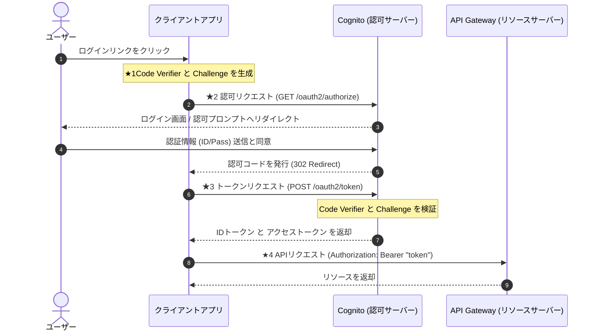
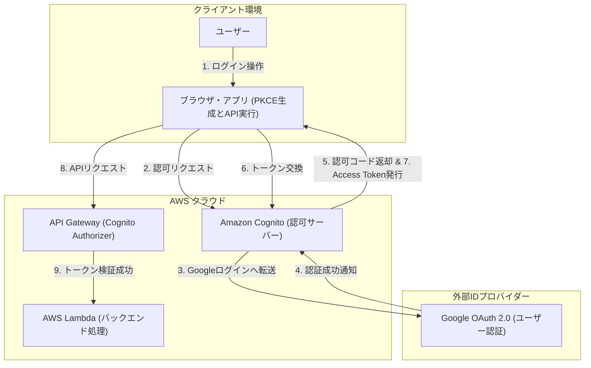

OAuth 2.0 の認可フロー、なんとなく分かっているけど細部が曖昧だったので、用語やフローを整理しました。
また、実際にAmazon Cognito + API Gatewayの環境を構築し、手を動かしながら OAuth 2.0 (+ PKCE) の挙動を確認していきます。

※本記事は作成時に Gemini を活用して仕様やパラメータの妥当性チェックを行っておりますが、もし記載に誤りや、より良い設計のアプローチなどがありましたら、ご指摘いただけますと幸いです
# 用語の整理

| 用語 | 説明 |
| --- | --- |
| 認証 | 「あなたが誰であるか」を特定・確認すること（例: ID/パスワードでのログイン）。 |
| 認可 | 「特定のリソースへのアクセス権限を与える」こと（例: APIの実行権限を与える）。 |
| OAuth2.0 | サードパーティアプリにアクセス権限を安全に委譲するための「認可」標準プロトコル。 |
| PKCE (ピクシー) | Proof Key for Code Exchangeの略。認可コードの横取りを防ぐためのOAuth 2.0拡張仕様。 |
| API Gateway (APIGW) | リクエストの受付・ルーティング・認証認可・レート制限などを一括管理するAPIフルマネージドサービス。 |
| Amazon Cognito | ユーザー認証（ユーザープール）と権限付与（アイデンティティプール）を提供するAWSのID管理サービス。 |

# OAuth2.0(+PKCE)の整理
認可フローとパラメータを整理します。
## 1) OAuth2.0(+PKCE)の認可フロー

## 2) リクエストのパラメータ
★1 事前準備（PKCEパラメータ生成）
| パラメータ| 説明 |
| --- | --- |
| Code Verifier| クライアント（アプリ）側でランダムに生成する暗号用文字列 |
| code_challenge_method| Code Verifier から Code Challenge を作成する際の変換アルゴリズム（通常は `S256` を指定）。 |
| Code Challenge| Code Verifier を `code_challenge_method` でハッシュ化した値。認可リクエスト時に送る。 |

★2 認可リクエスト (GET /oauth2/authorize)
| パラメータ | 説明 |
| --- | --- |
| response_type | 取得したい値を指定。認可コードグラントの場合は `code` を指定。 |
| client_id | Cognito で発行されたアプリクライアントID。 |
| redirect_uri | ログイン完了後に認可コードを送信するリダイレクト先URL。 |
| code_challenge | ★1 で生成したハッシュ化済みの値。 |
| code_challenge_method | 使用した変換手法（例: `S256`）。 |

★3 トークンリクエスト (POST /oauth2/token)
| パラメータ | 説明 |
| --- | --- |
| grant_type | 付与タイプ。`authorization_code` を指定。 |
| client_id | アプリクライアントID。 |
| code | 認可サーバーから受領した「認可コード」。 |
| redirect_uri | ★2 で送信した内容と同一のリダイレクトURL。 |
| code_verifier | ★1 で生成した「生の合言葉文字列」（認可サーバー側で検証に使用）。 |

★4 APIリクエスト (HTTP Header)
| ヘッダー名 | 設定値 | 説明 |
| --- | --- | --- |
| Authorization | `Bearer <access_token>` | 発行されたアクセストークンを Bearer スキームで付与。 |

# 検証
APIGW+Cognito(GoogleIDP)+Lambdaの構成で検証を行います。
## 1) 構成図

## 2) 準備
### ①ブラウザ・アプリ
AWSが用意しているCognito Hosted UI（標準ログイン画面）とターミナル（curl）を利用するため、特に準備は不要です。

### ②Google OAuth 2.0
Googleのアカウントでログインさせるための認証情報（OAuthクライアント）を発行します。

* **やること:**
1. [Google Cloud Console] でプロジェクトを作成。
2. 「OAuth 同意画面」を設定（テストユーザーに自身のGmailを追加）。
3. 「認証情報」から **OAuth 2.0 クライアント ID**（ウェブ アプリケーション）を作成。
4. リダイレクト URI に `https://<Cognitoドメイン>.auth.<リージョン>[.amazoncognito.com/oauth2/idpresponse](https://.amazoncognito.com/oauth2/idpresponse)` を登録。

* **次に使うメモ情報:**
  * クライアント ID
  * クライアント シークレット

### ③Amazon Cognito
認証の統合管理と、OAuth 2.0 / PKCE 認可サーバーとしての設定を行います。

* **やること:**
1. **ユーザープールを作成:** サインインオプションに「Eメール」を指定。
2. **外部IdP連携:** アイデンティティプロバイダーに「Google」を追加し、手順1の `クライアントID / シークレット` を設定。
3. **属性マッピング:** Googleの `email` を Cognito の `email` 属性に紐付け。
4. **アプリクライアント作成:**
* タイプ: シングルページアプリケーション (SPA)
* **「クライアントシークレットを生成しない」**（PKCE用パブリッククライアントにするため）。
* 認可プロバイダーに **Google** を追加。
* コールバックURL: `http://localhost:3000/callback` (検証用ダミー)

### ④AWS Lambda
API Gatewayから呼び出されるテスト用のバックエンド関数を用意します。

* **やること:**
1. AWS Lambda コンソールで関数（例: `test-backend-func`）を新規作成。
2. 200 OK とレスポンスメッセージ（例: `{"message": "Auth Success!"}`）を返すだけのコードにしてデプロイ。

* **次に使うメモ情報:**
  * 作成した Lambda 関数名

### ⑤API Gateway
Cognitoのアクセストークンを検証するオーソライザーと、Lambdaへのルーティングを設定します。

* **やること:**
1. **HTTP API を作成:** ルーティング `GET /secure-data` を追加し、手順3の **Lambda 関数** を統合。
2. **JWT オーソライザーを作成:**
* **Issuer (発行者):** `https://cognito-idp.<リージョン>[.amazonaws.com/](https://.amazonaws.com/)<ユーザープールID>`
* **Audience (対象者):** 手順2の **Cognito アプリクライアント ID**

3. **認可の紐付け:** `GET /secure-data` ルートに作成した JWT オーソライザーを割り当ててデプロイ。

* **次に使うメモ情報:**
  * API Gateway のステージエンドポイント URL

## 3) 検証

1. ターミナルで `Code Verifier` と `Code Challenge` をコマンド生成。
2. ブラウザで Hosted UI の認可URLを開き、Googleログインを行って `code`（認可コード）を取得。
3. ターミナルから `curl -X POST` で `code` と `code_verifier` を Cognito へ送信し、`access_token` を取得。
4. 取得した `access_token` を `Authorization: Bearer <access_token>` に設定して API Gateway へ curl リクエストを実行。
# ログ取得/解析
## 1)ログ取得
アクセスログ単体では code_verifier などの暗号パラメータ自体はセキュリティ上拾えないようです。
実務でトレーサビリティを確保するために、APIGWで何をログ出力すべきか
{
  "requestId": "$context.requestId",
  "ip": "$context.identity.sourceIp",
  "httpMethod": "$context.httpMethod",
  "path": "$context.path",
  "status": "$context.status",
  "userSub": "$context.authorizer.claims.sub",
  "email": "$context.authorizer.claims.email"
}

## 2)ログ解析
### ①トラブルシューティング時のログ確認ポイント

| トラブル発生箇所 | 確認すべきログ | チェックポイント |
| --- | --- | --- |
| **認可エラー** | ブラウザのURL / CloudFrontアクセスログ | `code_challenge` や `redirect_uri` の表記揺れ・ミスマッチがないか |
| **トークン発行エラー** | Cognito CloudWatch Logs / アプリのレスポンス | `code_verifier` のハッシュ検証失敗（400 Bad Request）が発生していないか |
| **API認可エラー** | API Gateway カスタムアクセスログ | `401 Unauthorized` が返っていないか、`claims.sub`（ユーザーID）が抽出できているか |

### ②APIGWアクセスログの解析(CloudWatch Logs Insights)
ログフォーマットによってクエリの実行内容は変わりますが、ワンライナーまとめておきます。

• 基本構文パターン（これをベースに改変）
fields @timestamp, @message | filter @message like /ERROR/ | sort @timestamp desc | limit 20

• APIGWで4xx/5xxエラーだけ抽出
fields @timestamp, status, path, responseLength | filter status >= 400 | sort @timestamp desc | limit 50

• 特定ユーザー（sub）のCognito認証ログ検索
fields @timestamp, @message | filter @message like /"sub": "xxxx-xxxx"/ | sort @timestamp desc

• ステータスコード別の集計（エラー件数カウント）
stats count(*) by status | sort count(*) desc

• JSONログから特定フィールドをパースして表示
parse @message 'status:* user:*' as status, userId | filter status = 401 | display @timestamp, userId

# 参照
* シーケンス図や構成図を作成する際に参考にしました
  * [Zenn - MarkdownでMermaidを使うメモ](https://zenn.dev/usagi1975/articles/2023-02-17-233300_mermaid_memo)
* OAuthの理解を深めるために参考にしました
  * [YouTube - OAuth 2.0 + OpenID Connect のフルスクラッチ実装者が語る](https://www.youtube.com/watch?v=PKPj_MmLq5E)
  * [Auth0 - PKCEを使用した認可コードフロー](https://auth0.com/docs/ja-jp/get-started/authentication-and-authorization-flow/authorization-code-flow-with-pkce)
  * [雰囲気で使わずきちんと理解する！OAuth 2.0（書籍）](https://nextpublishing.jp/book/10979.html)

